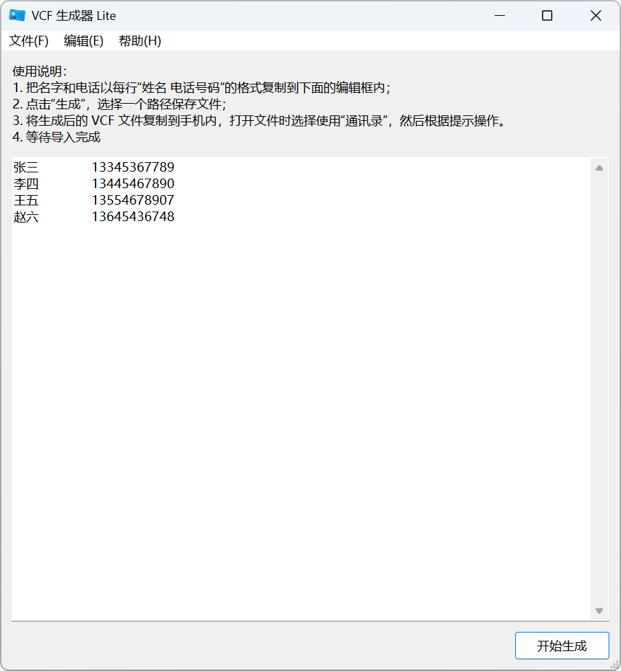

<div align="center">


# VCF Generator Lite

**Repositories**:
[][repository_gitee]
[][repository_github]

**Platforms**:
[][release_gitee]
[][release_gitee]

**Languages**:
[中文](./README.zh.md) |
**English** |
<small>More translations are welcome!</small>

</div>

VCF Generator Lite is a lightweight tool that quickly converts name and phone number lists into VCF files for batch
import to mobile contacts.

[](./LICENSE)
[](./docs/CODE_OF_CONDUCT.md)
[](https://github.com/psf/black)

[](https://github.com/HelloTool/VCFGeneratorLiteForTkinter/actions/workflows/test.yml)

## Screenshot



## Get the App

### Download the Packages

Download the software from the following channels:

- [Gitee Releases][release_gitee]
- [GitHub Releases][release_github]

Users of different systems need to download different files. You can make your selection according to the table below:

| Platform       | Package Type           | File                                                                     |
|----------------|------------------------|--------------------------------------------------------------------------|
| Windows        | Installer              | VCFGeneratorLite\_\<version\>\_**win-amd64**\_*setup.exe*                |
| Windows        | Portable               | VCFGeneratorLite\_\<version\>\_**win-amd64**\_*portable.zip*             |
| Cross-platform | Python ZIP Application | VCFGeneratorLite\_\<version\>\_**cpython-\[3.12\|3.13\]**\_*zipapp.pyzw* |

## Usage

1. Open the app.
2. Copy the name and phone number in the format of `Name PhoneNumber Note` on each line into the text field below. The
   note can be omitted.
   ```text
   Isaac Newton	13445467890	British mathematician
   Muhammad		13554678907
   Confucius		13645436748
   ```
3. Click "Generate", select a path to save the file.
4. Transfer the generated VCF file to your phone, select "Contacts" when opening the file, and follow the prompts to
   complete the import.
5. Wait for the import to complete.

> [!NOTE]
>
> - Tabs will be automatically converted to spaces for processing.
> - The program will automatically remove extra spaces from the text field.
>
> For example, ` Han Meimei   13333333333   A   well-known girl` will be recognized as
>
>
> > - Name: Han Meimei
> > - Phone: 13333333333
> > - Note: A well-known girl
>

## Compatibility

### System Requirements

| Software Package Type        | System Requirements           |
|------------------------------|-------------------------------|
| Windows Installer & Portable | Windows 8.1 or later          |
| Python Application           | Python 3.12 or later, Tkinter |

If you wish to use this application on Windows 8 or earlier versions, please refer
to [Running on Older Windows](./docs/compatibility/runs-on-older_windows.md).

On Windows systems, to launch the Python application by double-clicking, you need to install either
the [Python Launcher][pylauncher] or [Python Install Manager][pymanager].

### Features Compatibility

| System Environment  | Feature         | Details                                                            |
| ------------------- | --------------- | ------------------------------------------------------------------ |
| Windows 10 or later | Dark Mode       | Dark mode not supported                                            |
| Windows 10 or later | Display Scaling | Display scaling adaptation is handled by the OS when switching DPI |

### File Compatibility

- vCard Version: 2.1
- Supported Fields: Name, Phone Number, Notes
- Known Issues:
    - Windows Contacts may display garbled characters in non-UTF-8 environments

## Development & Contribution

Please refer to the [Development Guide (Chinese)](./docs/dev/README.md) and the [Contribution Guide (Chinese)](./docs/CONTRIBUTING.md).

## License

This project is released under the Apache 2.0 license. For details, please refer to [LICENSE](./LICENSE).

```txt
Copyright 2023-2025 Jesse205

Licensed under the Apache License, Version 2.0 (the "License");
you may not use this file except in compliance with the License.
You may obtain a copy of the License at

    http://www.apache.org/licenses/LICENSE-2.0

Unless required by applicable law or agreed to in writing, software
distributed under the License is distributed on an "AS IS" BASIS,
WITHOUT WARRANTIES OR CONDITIONS OF ANY KIND, either express or implied.
See the License for the specific language governing permissions and
limitations under the License.
```

## Open Source Notice

Please refer to [Open Source Notice (Chinese)](./docs/legal/os_notices.md)

## Special Thanks

Parts of the code in this project were generated with the assistance of AI coding tools (DeepSeek, Tongyi Lingma).

[repository_gitee]: https://gitee.com/HelloTool/VCFGeneratorLiteForTkinter/
[repository_github]: https://github.com/HelloTool/VCFGeneratorLiteForTkinter/
[release_gitee]: https://gitee.com/HelloTool/VCFGeneratorLiteForTkinter/releases/latest
[release_github]: https://github.com/HelloTool/VCFGeneratorLiteForTkinter/releases/latest

[pylauncher]: https://docs.python.org/zh-cn/3.15/using/windows.html#python-launcher-for-windows-deprecated

[pymanager]: https://docs.python.org/zh-cn/3.15/using/windows.html#python-install-manager
