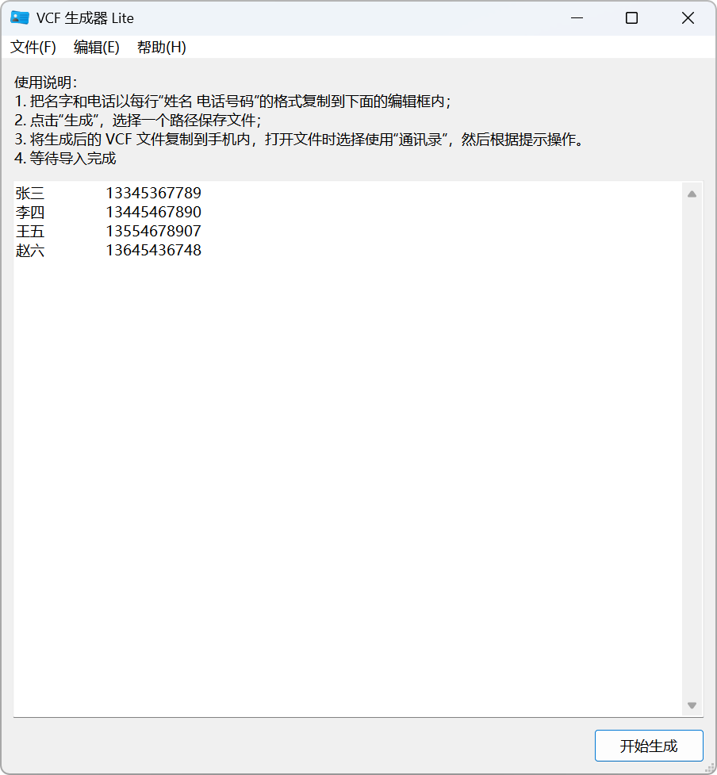

<div align="center">


# VCF 生成器 Lite

**仓库**：
[][repository-gitee]
[][repository-github]

**平台**：
[][release-gitee]
[][release-gitee]

**语言**：
**简体中文** |
[English](./README.md) |
<small>期待您的翻译！</small>

</div>

VCF 生成器 Lite 是一款轻量级工具，可将姓名和手机号列表快速转换为 VCF 文件，方便批量导入手机通讯录。

[](./LICENSE)
[](./docs/CODE_OF_CONDUCT.zh.md)
[](https://github.com/psf/black)

[](https://github.com/HelloTool/VCFGeneratorLiteForTkinter/actions/workflows/test.yml)

## 软件截图



## 获取应用

### 下载软件包

您可以通过以下渠道下载软件包：

- [Gitee 发行版][release-gitee]
- [GitHub Releases][release-github]

不同平台的用户需要下载不同的文件，您可以根据下表进行选择：

| 平台    | 软件包类型      | 文件                                                          |
| ------- | --------------- | ------------------------------------------------------------- |
| Windows | 安装程序        | VCFGeneratorLite\_\<应用版本\>\_**win-amd64**\_*setup.exe*    |
| Windows | 便携版          | VCFGeneratorLite\_\<应用版本\>\_**win-amd64**\_*portable.zip* |
| 跨平台  | Python ZIP 应用 | VCFGeneratorLite\_\<应用版本\>\_**python3**\_*zipapp.pyzw*    |

## 使用方法

1. 把名字和电话以每行 `姓名 电话号码 备注` 的格式复制到主界面的文本框中，其中备注可忽略。例如：
   ```text
   张三	13345367789	网络名人
   李四	13445467890
   王五	13554678907
   赵六	13645436748
   ```
2. 点击“生成”，选择一个路径保存文件。
3. 将生成后的 VCF 文件传输到手机内，打开文件时选择使用“通讯录”，然后根据提示操作。
4. 等待导入完成

> [!NOTE] 说明
>
> - 制表符会自动转换为空格处理，您可以同时使用制表符和空格分割姓名与电话号码。
> - 程序会自动去除文本框内多余的空格。
>
> 例如 `东坡居士 苏轼   13333333333  眉州眉山人` 将会被识别为
>
> > - 姓名：东坡居士 苏轼
> > - 电话：13333333333
> > - 备注：眉州眉山人
>

## 兼容性

### 系统要求

| 软件包类型               | 系统环境                        |
| ------------------------ | ------------------------------- |
| Windows 安装程序、便携版 | Windows 8.1 或更高版本          |
| Python ZIP 应用          | Python 3.12 或更高版本、Tkinter |

如果您想在 Windows 8 及以下版本中使用本应用，请参考[《在旧版本 Windows 中运行》](./docs/compatibility/runs-on-older-windows.md)。

在 Windows 中，如果您想直接双击启动 Python ZIP 应用，您需要安装 [Python 启动器][pylauncher] 或者 [Python 安装管理器][pymanager]。

### 功能兼容性

| 系统环境              | 特性     | 说明                                    |
| --------------------- | -------- | --------------------------------------- |
| Windows 10 或更高版本 | 深色模式 | 不支持深色模式                          |
| Windows 10 或更高版本 | 显示缩放 | 切换 DPI 时，由操作系统自动完成缩放适配 |

如果您想在 Windows 中使用深色模式，您可以[启用高对比度模式][windows-high-contrast-support]，或者使用 [Rectify11][rectify11] 或其他第三方工具修改系统主题。

### 文件兼容性

- vCard 版本：2.1
- 支持字段：姓名、电话号码、备注
- 已知问题：
  - Windows 联系人在非 UTF-8 环境下可能出现乱码

## 开发与贡献

请参阅[《开发指南》](./docs/dev/README.md)与[《贡献指南》](./docs/CONTRIBUTING.md)。

## 许可证

本项目以 Apache 2.0 许可证发布，详情请参阅 [LICENSE](./LICENSE)。

```txt
Copyright 2023-2025 Jesse205

Licensed under the Apache License, Version 2.0 (the "License");
you may not use this file except in compliance with the License.
You may obtain a copy of the License at

    http://www.apache.org/licenses/LICENSE-2.0

Unless required by applicable law or agreed to in writing, software
distributed under the License is distributed on an "AS IS" BASIS,
WITHOUT WARRANTIES OR CONDITIONS OF ANY KIND, either express or implied.
See the License for the specific language governing permissions and
limitations under the License.
```

## 开源声明

请参见 [《开源声明》](./docs/legal/os-notices.md)

## 特别感谢

本项目部分代码由 AI 编码助手（DeepSeek、通义灵码）辅助生成。

[repository-gitee]: https://gitee.com/HelloTool/VCFGeneratorLiteForTkinter/
[repository-github]: https://github.com/HelloTool/VCFGeneratorLiteForTkinter/
[release-gitee]: https://gitee.com/HelloTool/VCFGeneratorLiteForTkinter/releases/latest
[release-github]: https://github.com/HelloTool/VCFGeneratorLiteForTkinter/releases/latest
[pylauncher]: https://docs.python.org/zh-cn/3.15/using/windows.html#python-launcher-for-windows-deprecated
[pymanager]: https://docs.python.org/zh-cn/3.15/using/windows.html#python-install-manager
[windows-high-contrast-support]: https://support.microsoft.com/zh-cn/windows/%E5%9C%A8-windows-%E4%B8%AD%E6%9B%B4%E6%94%B9%E9%A2%9C%E8%89%B2%E5%AF%B9%E6%AF%94%E5%BA%A6-fedc744c-90ac-69df-aed5-c8a90125e696
[rectify11]: https://www.rectify11.com/
